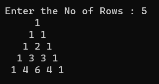

# Pattern

## Aim:
 To write a C# Program for Pascal Triangle.

## Equipment Required:
 Hardware - PC
 Software - Microsoft Studio Code (C#)
## Algorithm:

### Step 1:
Import the 'System' namespace to use the classes present in the 'System' namespace.

### Step 2:
Declare the Main method.

### Step 3:
Declare variable n,i,j,space.

### Step 4:
Using " Console.Write " print the statement and get the input from user using " Console.ReadLine " .

### Step 5:
Using for loop print the required pattern.

### Step 6:
Print the result.

## Program:
```
using System;
using System.Globalization;

namespace Pattern
{
    class Program
    {
        static void Main(string[] args)
        {
            int n,i,j,c=1,space;
            Console.Write("Enter the No of Rows : ");
            n=Convert.ToInt32(Console.ReadLine());
            for(i = 0; i < n; i++)
            {
                for(space=1;space<=n-i;space++)
                {
                    Console.Write(" ");
                }
               for( j=0 ; j<=i ; j++)
               {
                    if(i==0 || j==0)
                    {
                        c = 1;
                    }
                    else
                    {
                        c = c*(i - j + 1) / j;
                    }
                    Console.Write("{0} ",c);
                }
                Console.WriteLine();
            }
        }
    }
}
```
## Output:

## Result:
 Thus a C# Program for Pascal Triangle is written and executed sucessfully.